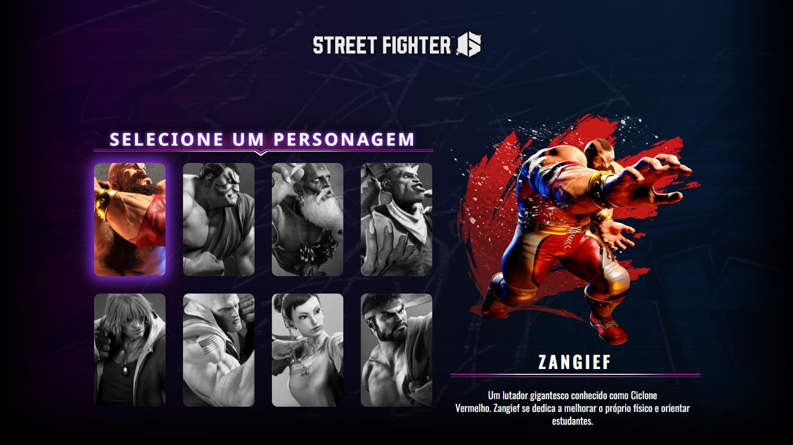

# Projeto Street Fighter 6 - SZPC



## ✨ Sobre o projeto

Este projeto foi criado na Semana do Zero ao Programador Contratado pelos gêmeos do canal Dev em Dobro, entre os dias 3 e 9 de julho de 2023. Durante essa semana, foi desenvolvido um projeto baseado no tema dos X-Men, e eu personalizei o meu projeto com o tema do jogo Street Fighter.

## 📚 Aprendizado

Consegui solidificar ainda mais minha base em HTML e CSS, além de praticar e aprender novos conceitos de JavaScript. Também descobri os atributos de dados (data attributes), que podem ser aplicados no HTML e posteriormente utilizados no JavaScript.

## ☕ Como utilizar:

1° Clone o repositório

```
git clone https://github.com/Fransuelton/street-fighter-6-project.git
```

2° Ou acesse o deploy do projeto [Clicando aqui](https://fransuelton.github.io/street-fighter-6-project/).

## 🛠️ Tecnologias Utilizadas

- HTML
- CSS
- JavaScript

### Obrigado por visitar meu repositório!❤️